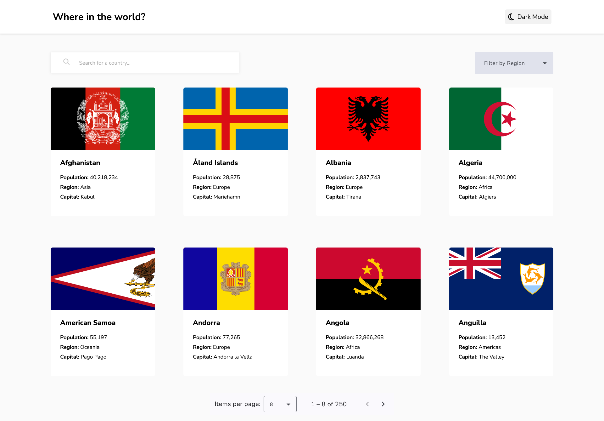

## Welcome! 👋

# Frontend Mentor - REST Countries API with color theme switcher solution

This is a solution to the [REST Countries API with color theme switcher challenge on Frontend Mentor](https://www.frontendmentor.io/challenges/rest-countries-api-with-color-theme-switcher-5cacc469fec04111f7b848ca). Frontend Mentor challenges help you improve your coding skills by building realistic projects. 

## Table of contents

- [Overview](#overview)
  - [The challenge](#the-challenge)
  - [Screenshot](#screenshot)
  - [Links](#links)
- [My process](#my-process)
  - [Built with](#built-with)
  - [What I learned](#what-i-learned)
- [Author](#author)

**Note: Delete this note and update the table of contents based on what sections you keep.**

## Overview

### The challenge

Users are able to:

- See all countries from the API on the homepage
- Search for a country using an `input` field
- Filter countries by region
- Click on a country to see more detailed information on a separate page
- Click through to the border countries on the detail page
- Toggle the color scheme between light and dark mode

### Screenshot

### Links

- Solution URL: [Link](https://www.frontendmentor.io/solutions/rest-countries-api-with-color-theme-switcher-built-w-angular-j-ZEYa4cFc)
- Live Site URL: [Link](https://rest-countries-api-lilac-alpha.vercel.app/)

## My process

### Built with

- [Angular](https://angular.dev/)
- TypeScript
- SCSS
- Mobile-first workflow

### What I learned

This project was a very good exercise to put into practice a lot of Angular important concepts, such as components, directives, pipes, and services (both for HTTP requests and light/dark mode feature).

## Author

- Frontend Mentor - [@danielmrz-dev](https://www.frontendmentor.io/profile/danielmrz-dev)
- LinkedIn - [@danielmrz-dev](https://www.linkedin.com/in/danielmrz-dev/)